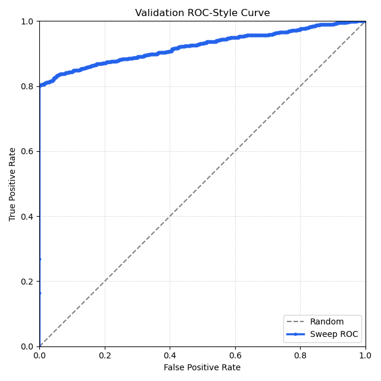
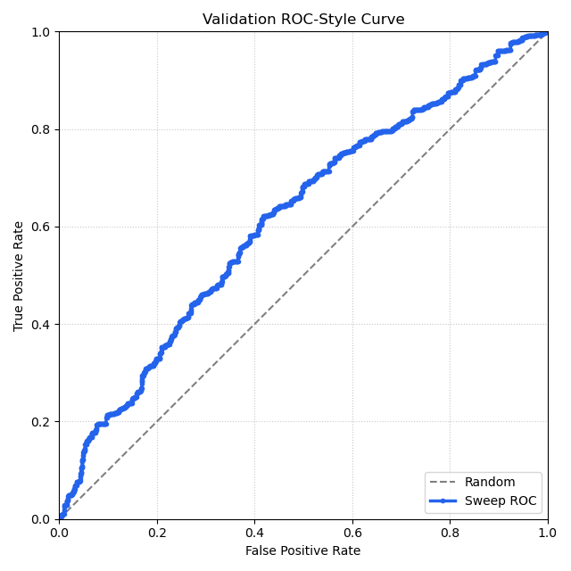

# Evaluation Report for Milestone 2

## Overview
We built a simple face verification system using the LFW dataset. Each image is:
- converted to grayscale
- resized to 32x32
- flattened into a vector
- L2 normalized

We then compute cosine similarity between two images and compare it to a threshold to decide if they are the same person.
We ran multiple tracked experiments, including baseline and a data-centric version with a modified pair construction.

-----

## Baseline Results
We first ran a threshold sweep on the validation set using the original pair set (`outputs/pairs`). The best threshold was then selected using validation F1 score.

**Selected Threshold:** 0.9267

### ROC-style plot (validation)

### Confusion matrix (test)

|               | Pred Same | Pred Diff |
|-------------- |-----------|-----------|
| Actual Same   | 830       | 170       |
| Actual Diff   | 4         | 996       |

### Metrics (test)

- Accuracy: 0.913
- Precision: 0.995
- Recall: 0.830
- F1: 0.905

The baseline is very precise (almost no false positives) but it does miss some same-identity pairs.

-----

## Data-centric change
We created the second version of the dataset (`outputs/pairs_v2`) where:

- self pairs are removed from validation and test
- training pairs are unchanged

We did this because self-pairs (same image on both sides) are extremely easy and inflate performance. Removing them makes the evaluation more realistic.

-----

## Updated Results
We repeated the same process on the new pair set.

**Selected threshold:** 0.5853  

### ROC-style plot (validation)

### Confusion matrix (test)

|               | Pred Same | Pred Diff |
|--------------|-----------|-----------|
| Actual Same  | 938       | 62        |
| Actual Diff  | 953       | 47        |

### Metrics (test)

- Accuracy: 0.4925  
- Precision: 0.4960  
- Recall: 0.938  
- F1: 0.6489  

The performance drops a lot after this change. This shows that the original setup was overestimating performance due to easy self pairs.

-----

## Error Analysis

We analyzed errors by filtering the saved test scores (`*_test_scores.jsonl`) based on label and threshold.

-----

### Error Slice 1 — Baseline False Negatives

**Definition:**  
Same-identity test pairs where the score is below the threshold (0.9267).

**Size:**  
170 examples.

**Examples:**
- Will_Smith_0001 vs Will_Smith_0002 → score: 0.6110  
- Zoran_Djindjic_0003 vs Zoran_Djindjic_0004 → score: 0.6975  
- Thomas_OBrien_0008 vs Thomas_OBrien_0007 → score: 0.8340  

**What’s going on:**  
Even though these are the same person, the similarity is low. This is likely because the images differ in things like pose, lighting, or facial expression. Since we’re using raw pixel values, the representation is very sensitive to these changes.

**Possible improvement:**  
Some basic preprocessing like face alignment or using a slightly better feature representation could help reduce sensitivity to pose and lighting changes.

-----

### Error Slice 2 — After-Change False Positives

**Definition:**  
Different-identity test pairs where the score is above the threshold (0.5853).

**Size:**  
953 examples.

**Examples:**
- Trevor_McDonald_0001 vs Thomas_Van_Essen_0001 → score: 0.7636  
- William_Nessen_0001 vs Sun_Myung_Moon_0001 → score: 0.7295  
- Sylvia_Plachy_0001 vs Turner_Stevenson_0001 → score: 0.8171  

**What’s going on:**  
These are different people, but the model thinks they’re the same. This happens because the pixel-based representation can’t capture identity well. If two images look similar in terms of lighting, angle, or contrast, their cosine similarity can still be high.

Also, the threshold dropped a lot after the data change, which increases recall but leads to many false positives.

**Possible improvement:**  
Using a more informative representation than raw pixels or tuning the threshold differently could help reduce these false positives.

-----

## Conclusion
Removing self pairs made the evaluation more realistic. The baseline originally looked strong but after the change, performance dropped by quite a bit.

This shows that:
- the original evaluation was too easy
- the model is not robust to real variation
- the raw pixel cosine approach is limited

Overall, the data centric change didn't improve metrics but it helped reveal the true weakness of the system.
